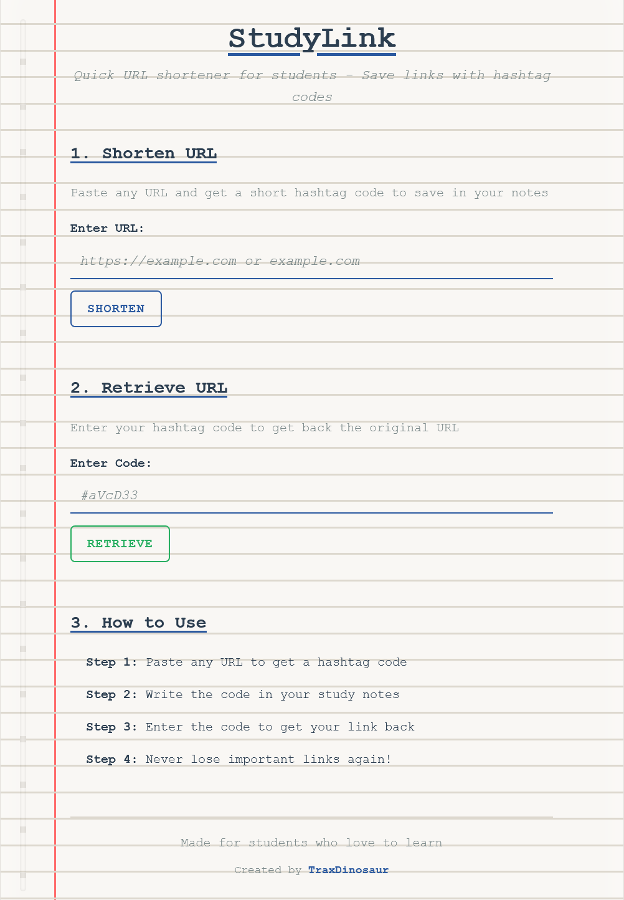

# 📚 StudyLinks

A simple, fast, and friendly **URL shortener** built with Flask + MongoDB. Perfect for saving long educational links with a quick code you can remember. 🧠🔗

---

### 🚀 Try it out

Paste your long study URL, get a tiny code like `#abc123`, and use that code to get back to it later!

---

### 🌟 Features

- 🔒 URL validation & smart formatting
- 🪄 Random code generation (like `#xYz9T3`)
- 💾 MongoDB for persistent storage
- 📈 Basic API for stats

---

### 🛠️ Tech Stack

- Python (Flask)
- MongoDB Atlas
- HTML + Bootstrap (for the frontend)

---

### 📸 Screenshots



---

### 💡 Getting Started

1. **Clone the repo**
   ```bash
   git clone https://github.com/TraxDinosaur/StudyLinks.git
   cd StudyLinks
   ````

2. **Install dependencies**

   ```bash
   pip install -r requirements.txt
   ```

3. **Run the server**

   ```bash
   python app.py
   ```

4. **Open your browser**

   ```
   http://localhost:5000
   ```

---

### 🧪 API Endpoint

* `/api/stats` – returns basic count of stored links

```json
{
  "total_urls": 12,
  "total_codes": 12
}
```

---

### 👤 Author

**TraxDinosaur**
🌐 [traxdinosaur.github.io](https://traxdinosaur.github.io)

---

### 📄 License

Creative Commons BY-SA 4.0
Feel free to remix or share – just give credit and share alike.

---
